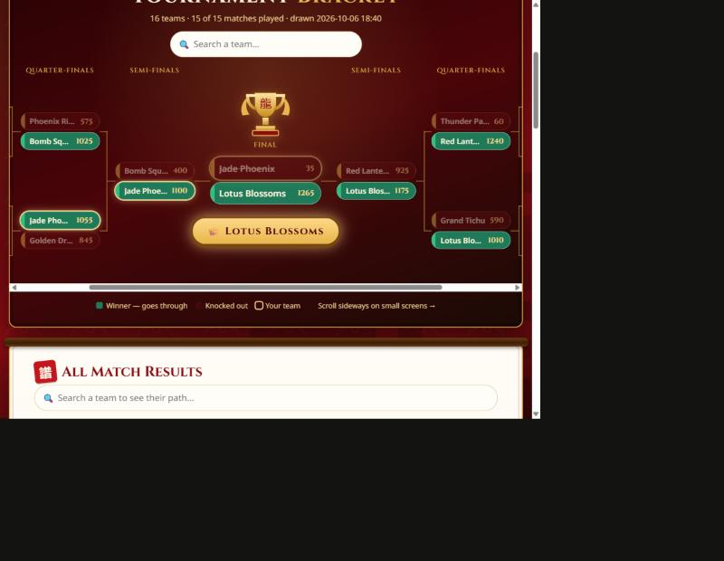
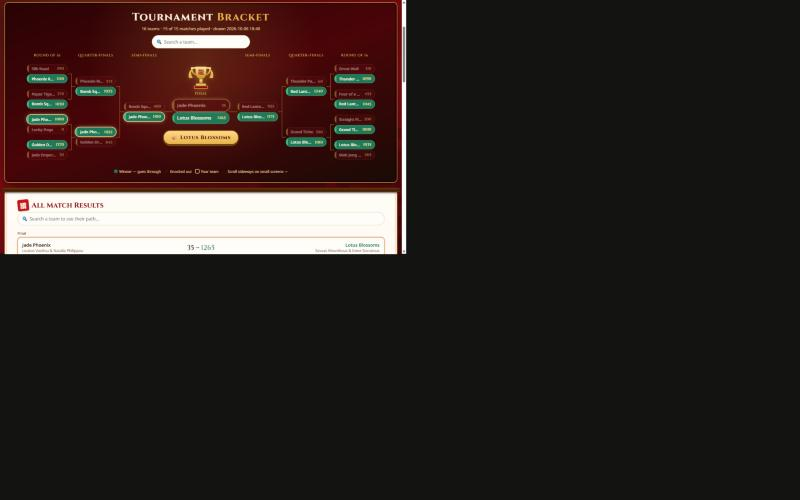

# 🐉 Dragon Tichu Cup — Tournament Website

A website for running a **Tichu** tournament from start to finish: teams register on their phones, the organizer draws a random knockout bracket, players enter every hand on an iTichu-style score sheet, and winners move through the bracket automatically until a champion is crowned.

## Features

- **Team registration** — team name, both players, phone number and a 4–8 digit team PIN.
- **Team login** — log in with team name + PIN to see your matches, the other teams and the bracket.
- **Random knockout bracket** — one button draws it. Works for any number of teams from 2 to 32; when the count isn't 2/4/8/16/32, some teams get a bye into round 2.
- **iTichu-style score sheet** for every match — enter one team's card points (the other team gets 100 minus that), switch on Tichu / Grand Tichu (made or failed) and double wins (1-2). Running totals, full hand history and undo. First to 1000 wins and advances.
- **Live bracket** — mirrored layout with the trophy and champion in the middle. Search a team to highlight its path.
- **Tournament statistics** — totals, highlights (best hand, biggest win, most Tichus…) and a sortable table for every team.
- **Admin panel** — draw/redraw the bracket, open any score sheet, clear a match, reset team PINs, remove teams. Only the organizer sees phone numbers.
- Works on phones, tablets and desktops. No database needed.

## Requirements

- PHP 8 with Apache (any normal shared hosting with cPanel, or XAMPP on your own computer)
- The `data/` folder must be writable by the web server

## Setup

1. Upload all files to your web hosting (for example into `public_html`).
2. Copy `config.example.php` to **`config.php`** and set your own admin password.
3. Edit the tournament name, date, place, team limit and target score at the top of `lib.php`.
4. Open the site, register teams, then log in at `admin.php` and press **Draw Bracket**.

Check that `https://your-site/data/registrations.json` shows **403 Forbidden** — the `data/.htaccess` file keeps team data private.

## Files

| File | What it does |
|---|---|
| `index.php` | Team registration |
| `login.php`, `logout.php` | Team login |
| `dashboard.php` | A team's own page: status, matches, all teams |
| `match.php` | The hand-by-hand score sheet |
| `bracket.php` | The knockout bracket |
| `stats.php` | Tournament-wide statistics |
| `admin.php` | Organizer panel |
| `lib.php` | Settings, storage, bracket and scoring logic |
| `partials.php` | Shared page layout, dragon header, bracket drawing |
| `style.css` | All styling |
| `config.php` | Admin password (not in git — copy from `config.example.php`) |
| `data/` | Teams, bracket and scores, saved as JSON (not in git) |

## Scoring rules

- Card points always total 100 per hand (the Phoenix can make it −25 / 125).
- Tichu ±100, Grand Tichu ±200. Only one call can succeed per hand.
- Double win (1-2): 200 points, card points not counted.
- A match ends when a team reaches 1000 (`TARGET_SCORE` in `lib.php`) and is ahead; if level, play another hand.
